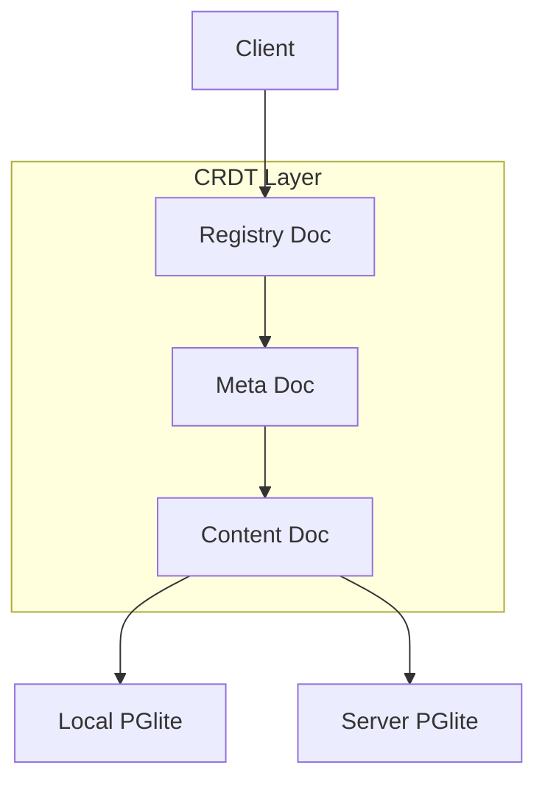

# Hominio Kernel Architecture

## Overview

Hominio uses a hierarchical CRDT-based document system built on Loro, with local PGlite storage on both client and server. The system leverages Loro's automatic conflict resolution at all levels while maintaining local persistence.

## Core Components

1. **Hierarchical Document Structure**
   
   a. **Registry Document (Top Level)**
   - Acts as a global CRDT-based registry for document discovery
   - Maps identifiers to both meta and content document hashes
   - Example:
     ```typescript
     interface RegistryDoc {
       @id: string;          // e.g., "0x00000"
       @type: "registry";
       metaDocHash: string;  // Points to current meta state
       contentDocHash: string; // Points to current content state
     }
     ```

   b. **Meta Document (Middle Level)**
   - Contains sync state and access control
   - Managed as a Loro CRDT document
   - Example:
     ```typescript
     interface MetaDoc {
       @id: string;         // Meta doc hash
       @type: "meta";
       peers: {
         [peerId: string]: {
           role: "admin" | "peer";
           lastSyncedAt: number;
           lastKnownContentHash: string;
           lastKnownMetaHash: string;
         }
       };
       accessControl: {
         canWrite: string[];
         canRead: string[];
       }
     }
     ```

   c. **Content Document (Bottom Level)**
   - Contains the actual data
   - Full CRDT capabilities for automatic conflict resolution
   - Example:
     ```typescript
     interface ContentDoc {
       @id: string;        // Content hash
       @type: "content";
       data: Record<string, unknown>;
     }
     ```

2. **Storage Layer**
   - **PGlite Instances**
     - Server-side PGlite for persistent storage
     - Client-side PGlite for local caching
     - Stores all three document types
   - **Document Schema**
     ```sql
     CREATE TABLE documents (
       doc_id TEXT PRIMARY KEY,
       doc_type TEXT NOT NULL,
       loro_data BLOB,
       last_updated TIMESTAMP
     )
     ```

## Document Flow



## Synchronization Process

1. **Automatic CRDT Resolution**
   - All documents (Registry, Meta, Content) are Loro CRDT docs
   - No manual conflict resolution needed
   - Automatic convergence at all levels

2. **Document Updates**
   a. **Content Changes**
   ```
   Peer makes content change
   ↓
   CRDT automatically resolves conflicts
   ↓
   New content state propagated
   ↓
   Meta doc updated with new peer status
   ↓
   Registry remains unchanged
   ```

   b. **Meta Changes**
   ```
   Admin updates meta doc
   ↓
   CRDT automatically resolves conflicts
   ↓
   New meta state propagated
   ↓
   Registry updated if needed
   ```

3. **Local Storage**
   - Each peer maintains local PGlite instance
   - Stores all three document types
   - Automatic CRDT state tracking

## Implementation Details

### Document Management
```typescript
class DocumentManager {
  // Registry operations
  async getRegistry(): Promise<RegistryDoc>;
  async updateRegistry(metaHash: string, contentHash: string): Promise<void>;

  // Meta operations
  async getMetaDoc(hash: string): Promise<MetaDoc>;
  async updatePeerStatus(peerId: string, status: PeerStatus): Promise<void>;

  // Content operations
  async getContentDoc(hash: string): Promise<ContentDoc>;
  async updateContent(data: Record<string, unknown>): Promise<void>;
}
```

### Sync Service
```typescript
class SyncService {
  async syncState() {
    // 1. Sync Registry Doc
    await this.syncRegistryDoc();
    
    // 2. Sync Meta Doc if needed
    const registry = await this.getRegistry();
    await this.syncMetaDoc(registry.metaDocHash);
    
    // 3. Sync Content Doc if needed
    await this.syncContentDoc(registry.contentDocHash);
    
    // 4. Update peer status in Meta
    await this.updatePeerStatus();
  }
}
```

## UI Organization

The interface is split into three main views:

1. **Left Panel: Document Content**
   - Content document view/edit
   - Real-time CRDT updates

2. **Right Panel: Meta & Sync**
   - Peer status list
   - Access control settings
   - Sync status visualization

3. **Top Bar: Registry Info**
   - Current document hashes
   - Quick navigation
   - System status

This organization reflects the hierarchical nature of the system while making it easy to monitor and manage the CRDT state at all levels.

