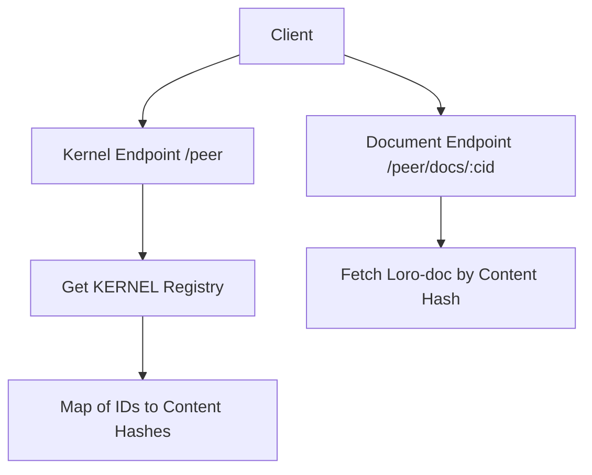

# Hominio Kernel Architecture

## Overview

Hominio uses a content-addressable document system built on Loro-docs, similar to IPFS but with CRDT capabilities. The system consists of two main components:

1. **KERNEL Document (IPNS-like Registry)**
   - Acts as an immutable registry (similar to IPNS)
   - Maps contract-like identifiers to content hashes
   - Example: `{"0x00012341234": "blake3_content_hash_of_loro_doc"}`
   - Provides a stable reference point for the entire system

2. **Content-Addressable Loro-docs**
   - Each Loro-doc is identified by its Blake3 content hash
   - Immutable snapshots of documents
   - Content-addressed storage similar to IPFS
   - Example: A simple "Hello Earth" document with its corresponding hash

## Document Flow

## Loading Process

1. **Initial Kernel Load**
   - Client requests `/peer` endpoint
   - Server returns KERNEL registry document
   - Contains mappings of IDs to content hashes

2. **Document Resolution**
   - Client receives an ID (e.g., "0x00012341234")
   - Looks up content hash in KERNEL registry
   - Requests `/peer/docs/:contentHash`
   - Server returns corresponding Loro-doc

## Content Addressing

- Uses Blake3 for content hashing
- Fast and cryptographically secure
- Content hash is derived from Loro-doc state
- Ensures document integrity and uniqueness

## Implementation Details

### Server-side
- Root endpoint (`/peer`) serves KERNEL registry
- Document endpoint (`/peer/docs/:cid`) serves individual Loro-docs
- Blake3 hashing for content addressing
- In-memory or persistent storage of Loro-docs

### Client-side
- Two-step loading process:
  1. Load KERNEL registry
  2. Load specific documents by content hash
- Caching of frequently accessed documents
- Real-time CRDT synchronization

